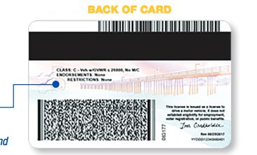
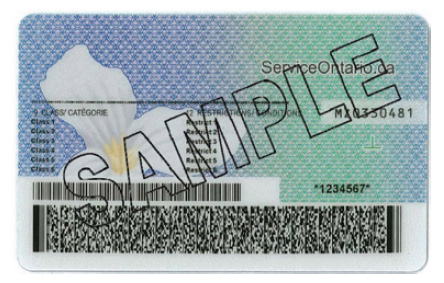
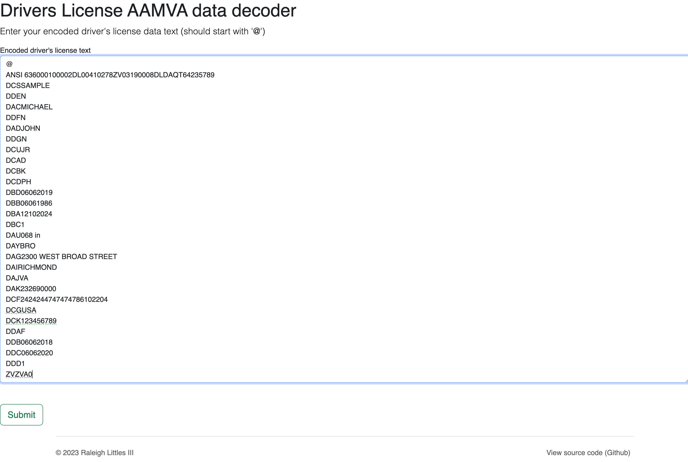
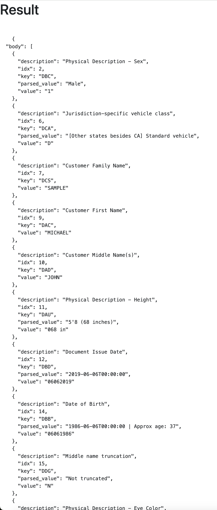

# Context

[AAMVA](https://www.aamva.org/) is an organization that produces the standards around, among other things, Driver's Licenses. These standards are implemented so that driver's licenses can easily be transferred across different states.

Any driver's license issued in the US or Canada, has to have a [PDF-417 barcode](https://en.wikipedia.org/wiki/PDF417) on the back that encodes the ID's AAMVA data.





For example, if you're from New York and are pulled over in Montana, the Montana police would scan this barcode to electronically verify your ID is valid, and digitally read the information on it as if you were in New York.

There are over 50 different AAMVA fields, that include basic information for things like your physical description (since your driver's license is supposed to be a basic form of identification), but also driving-specific fields like what "class" of license you have.

# About

This project is a simple Flask webapp that allows you to easily decode these AAMVA fields from a driver's license.

Simply use a PDF-417 scanner online (I like [this](https://online-barcode-reader.inliteresearch.com/) one), and then paste the data into the form.



The output will show each of the decoded AAMVA fields.



# Usage

Install dependencies

```bash
$ pip install -r requirements.txt
```

Launch flask app:

```bash
$ flask --app flask_dl_decoder_app run --debug
```

You can also run this as a CLI app on its own.

```
options:
  -h, --help            show this help message and exit
  -f TEXT_FILE, --text-file TEXT_FILE
                        Input text file containing the decoded PDF-417 data, to read from
  -o OUTPUT_FILE, --output-file OUTPUT_FILE
                        Output text file to write results to
```

# Standards and more

The code supports decoding fields from the AAMVA 2020 standard (version 10). You'll find a copy of the standards document in the `standards` folder.

The sample test case for AAMVA data is in the `examples` folder.